# Entrega 2 — Cartografía y Estrategia de Modernización
## Spring PetClinic

| Campo | Valor |
|-------|-------|
| **Proyecto** | Modernización de Spring PetClinic |
| **Repositorio** | `spring-petclinic` |
| **Stack legado (as-is)** | Java 17 · Spring Boot 4.0.3 · Spring MVC · Thymeleaf · JPA |
| **Estrategia elegida** | Replatform + Rearchitect (Migration) |
| **Estado** | Iteración 1 ✅ · Iteración 2 ✅ |

---

## Estado de iteraciones

| Iteración | Objetivo | Estado |
|-----------|----------|--------|
| **1** | Validar arquitectura as-is contra código fuente | ✅ Completada |
| **2** | Integrar evidencia CodeScene (M1–M4, degradación) | ✅ Completada |
| 3 | Decidir estrategia con alternativas | Pendiente |
| 4 | Acotar alcance realista | Pendiente |
| 5 | Cierre documento + PNG | Pendiente |

## Tabla de contenidos

1. [Actividad 1 — Cartografía](#actividad-1--cartografía)
2. [Actividad 2 — Estrategia y alcance](#actividad-2--estrategia-y-alcance)
3. [Diagramas PlantUML](#diagramas-plantuml)
4. [Uso de IAG](#uso-de-iag)
5. [Anexos CodeScene](#anexos-codescene)

---

# Actividad 1 — Cartografía

## 1.1 Justificación de la herramienta de cartografía

Se adopta una **estrategia híbrida** que combina análisis automático de calidad de código con modelado arquitectónico manual:

| Herramienta | Rol | Justificación |
|-------------|-----|---------------|
| **CodeScene** | Métricas de mantenibilidad: hotspots, acoplamiento, salud del código, duplicación, evolución | Cuantifica deuda técnica con evidencia objetiva. Es la herramienta del curso para evaluar legado. Responde preguntas del eje de **mantenibilidad**. |
| **Cartografía manual del repositorio** | Análisis de `pom.xml`, paquetes Java, perfiles Spring, esquemas SQL, CI/CD y despliegue | CodeScene no modela despliegue, relaciones con BD ni patrones arquitectónicos a nivel de sistema. Responde preguntas del eje de **arquitectura**. |
| **PlantUML** | Diagramas UML en texto plano (`.puml`): componentes, despliegue, dominio y alcance | Versionable en Git, editable como código y exportable a PNG/SVG. Representa la **arquitectura concreta** de la aplicación (no la referencia genérica de Spring). |

**Limitación de documentación existente:** El README y las [slides legacy](https://speakerdeck.com/michaelisvy/spring-petclinic-sample-application) describen una versión **pre–Spring Boot**. No reflejan la arquitectura actual del repositorio.

---

## 1.2 Preguntas de comprensión del legado

### Eje: Arquitectura

| ID | Pregunta |
|----|----------|
| **A1** | ¿Cuáles son los componentes funcionales de la aplicación y cómo se relacionan entre sí? |
| **A2** | ¿Cómo es el despliegue de los componentes (runtime, contenedores, bases de datos)? |
| **A3** | ¿Cómo se relacionan los componentes de la aplicación con las fuentes de datos? |
| **A4** | ¿Qué patrones y tácticas arquitectónicas utiliza la aplicación? |

### Eje: Mantenibilidad

| ID | Pregunta |
|----|----------|
| **M1** | ¿Cuáles son los componentes más grandes en términos de líneas de código? |
| **M2** | ¿Cuáles son los componentes más fuertemente acoplados? |
| **M3** | ¿Existe código muerto, duplicado o lógica de negocio mal ubicada? |
| **M4** | ¿Cuál es la cobertura de pruebas y qué módulos están menos protegidos? |

---

## 1.3 Respuestas — Arquitectura (Iteración 1 — validado en código)

> Cada afirmación incluye referencia al archivo fuente verificado en el repositorio.

### A1 — Componentes funcionales y relaciones

Spring PetClinic es un **monolito Spring Boot** empaquetado como JAR único:

| Métrica | Valor verificado |
|---------|------------------|
| Clases producción | 30 archivos `.java` |
| LOC producción | 1.931 |
| Controladores | 6 (`@Controller`) |
| Repositorios | 3 interfaces Spring Data |
| Entidades JPA | 8 (`@Entity`) |
| Templates Thymeleaf | 12 |

#### Inventario de endpoints HTTP

| Ruta | Método | Controller | Repositorio(s) | Vista / respuesta |
|------|--------|------------|----------------|-------------------|
| `/` | GET | `WelcomeController` | — | `welcome.html` |
| `/owners/find` | GET | `OwnerController` | — | `owners/findOwners.html` |
| `/owners` | GET | `OwnerController` | `OwnerRepository` | `ownersList.html` o redirect |
| `/owners/new` | GET/POST | `OwnerController` | `OwnerRepository` | `createOrUpdateOwnerForm.html` |
| `/owners/{id}` | GET | `OwnerController` | `OwnerRepository` | `ownerDetails.html` |
| `/owners/{id}/edit` | GET/POST | `OwnerController` | `OwnerRepository` | formulario + redirect |
| `/owners/{id}/pets/new` | GET/POST | `PetController` | `OwnerRepository`, `PetTypeRepository` | `createOrUpdatePetForm.html` |
| `/owners/{id}/pets/{petId}/edit` | GET/POST | `PetController` | `OwnerRepository`, `PetTypeRepository` | formulario + redirect |
| `/owners/{id}/pets/{petId}/visits/new` | GET/POST | `VisitController` | `OwnerRepository` | `createOrUpdateVisitForm.html` |
| `/vets.html` | GET | `VetController` | `VetRepository` | `vets/vetList.html` (paginado) |
| `/vets` | GET | `VetController` | `VetRepository` | JSON (`@ResponseBody Vets`) |
| `/oups` | GET | `CrashController` | — | lanza excepción → `error.html` |

#### Componentes por paquete

| Paquete | Clases clave | Rol |
|---------|--------------|-----|
| `owner/` | 4 controllers, 4 entidades, 2 repos, `PetValidator`, `PetTypeFormatter` | Núcleo funcional (~62% LOC) |
| `vet/` | `VetController`, `Vet`, `Specialty`, `Vets`, `VetRepository` | Consulta vets |
| `model/` | `BaseEntity`, `Person`, `NamedEntity` | Herencia compartida |
| `system/` | `WelcomeController`, `CrashController`, `CacheConfiguration`, `WebConfiguration` | Infra web |

#### Relaciones verificadas

1. **Sin capa `@Service`:** ningún `@Service` en `src/main/java`. Los 4 controllers de negocio inyectan repositorios en el constructor (p. ej. `OwnerController` L53–57).
2. **Agregado Owner:** `Owner` persiste en cascada `Pet` y `Visit` vía `@OneToMany(cascade = ALL, fetch = EAGER)` (`Owner.java` L64–67; `Pet.java` L56–59).
3. **PetController es el más acoplado:** depende de `OwnerRepository` + `PetTypeRepository` + `PetValidator` (`PetController.java` L52–58).
4. **VisitController navega el agregado:** carga `Owner` → `Pet` → crea `Visit` → `owners.save(owner)` (`VisitController.java` L63–109).
5. **Único endpoint REST:** `GET /vets` retorna JSON; todo lo demás es HTML (`VetController.java` L69–75).

**Evidencia visual:** `docs/plantuml/01-componentes-as-is.puml`, `06-secuencia-buscar-owner.puml`, `07-secuencia-agregar-pet.puml`.

---

### A2 — Despliegue de componentes

| Aspecto | Detalle verificado | Fuente |
|---------|-------------------|--------|
| Empaquetado | JAR ejecutable Spring Boot 4.0.3 | `pom.xml` L7–8 |
| Java runtime | 17 (CI y build) | `pom.xml` L19; `maven-build.yml` L18 |
| BD por defecto | H2 embebida, `database=h2` | `application.properties` L2–4 |
| Perfil MySQL | `spring.profiles.active=mysql` | `application-mysql.properties` |
| Perfil PostgreSQL | `spring.profiles.active=postgres` | `application-postgres.properties` |
| Docker Compose | **Solo BD** (MySQL 9.6, PostgreSQL 18.3); la app no está en compose | `docker-compose.yml` |
| Imagen contenedor | `./mvnw spring-boot:build-image` (Buildpacks) | README |
| Kubernetes | Deployment 1 réplica, imagen `dsyer/petclinic`, perfil `postgres`, probes `/livez`/`/readyz` | `k8s/petclinic.yml` |
| Actuator | Todos los endpoints expuestos en dev (`include=*`) | `application.properties` L21 |
| CI | `./mvnw -B verify` en Java 17; workflow Gradle paralelo | `.github/workflows/` |

**Corrección respecto al borrador anterior:** `docker-compose.yml` no despliega la aplicación; solo provisiona bases de datos. La app se ejecuta localmente o en K8s con perfil acorde.

**Evidencia visual:** `docs/plantuml/02-despliegue.puml`.

---

### A3 — Relación con fuentes de datos

Configuración JPA verificada:

```properties
spring.jpa.hibernate.ddl-auto=none
spring.jpa.open-in-view=false
spring.jpa.hibernate.naming.physical-strategy=...SnakeCaseImpl
```

Esquema y datos inicializados por scripts SQL parametrizados: `classpath*:db/${database}/schema.sql` y `data.sql`.

| Repositorio | Tipo Spring Data | Operaciones usadas | Tablas |
|-------------|------------------|-------------------|--------|
| `OwnerRepository` | `JpaRepository<Owner, Integer>` | `save`, `findById`, `findByLastNameStartingWith` | `owners`, `pets`, `visits` (cascada) |
| `PetTypeRepository` | `JpaRepository<PetType, Integer>` | `findPetTypes()` con `@Query` JPQL | `types` |
| `VetRepository` | `Repository<Vet, Integer>` (mínimo) | `findAll()`, `findAll(Pageable)` + `@Cacheable` | `vets`, `specialties`, `vet_specialties` |

**Mapeo entidad ↔ tabla (verificado):**

| Entidad | Tabla | Relación JPA |
|---------|-------|--------------|
| `Owner` | `owners` | `@OneToMany` → `Pet` (EAGER, cascade ALL) |
| `Pet` | `pets` | `@ManyToOne` → `PetType`; `@OneToMany` → `Visit` |
| `Visit` | `visits` | Columna `visit_date` mapeada a campo `date` |
| `Vet` | `vets` | `@ManyToMany` → `Specialty` vía `vet_specialties` |

**Evidencia:** `schema.sql`, entidades en `owner/` y `vet/`; diagrama `03-modelo-dominio.puml`.

---

### A4 — Patrones y tácticas arquitectónicas

| Patrón / táctica | Evidencia en código |
|------------------|---------------------|
| **Layered MVC** | 6 `@Controller` + 12 templates Thymeleaf |
| **Repository** | 3 interfaces; `VetRepository` es interfaz mínima, no `JpaRepository` |
| **Aggregate Root** | `Owner.addPet()`, `Owner.addVisit()`; persistencia vía `owners.save()` |
| **Entity inheritance** | `BaseEntity` → `Person`/`NamedEntity` → subclases |
| **Profile-based config** | Placeholder `${database}` en SQL init |
| **Cache-Aside** | `@Cacheable("vets")` + `CacheConfiguration` crea cache JCache |
| **PRG + Flash attributes** | Redirects post-POST en todos los formularios |
| **Custom validation** | `PetValidator` registrado en `@InitBinder` de `PetController` |
| **i18n** | `WebConfiguration` + 9 archivos `messages_*.properties`; `?lang=` |
| **API híbrida** | Solo `/vets` es JSON; resto server-rendered |

**Deuda arquitectónica confirmada (no inferida):**

| Hallazgo | Evidencia |
|----------|-----------|
| Sin capa de servicios | 0 clases `@Service` en producción |
| Lógica de negocio en controllers | Validación duplicado/fecha en `PetController` L110–117; visita futura en `VisitController` L100 |
| Fetch EAGER en agregados | `Owner.pets`, `Pet.visits`, `Vet.specialties` — riesgo N+1 mitigado parcialmente con `default_batch_fetch_size=16` |
| `CrashController` expuesto | `GET /oups` lanza `RuntimeException` a propósito |

**Evidencia visual:** `docs/plantuml/05-capas-arquitectonicas.puml`.

**Evidencia CodeScene — Architectural Hotspots (configuración inicial):**

Componentes definidos: `Presentation`, `Persistencia`, `Dominio`. La mayor parte del código aparece en **No Component** (hotspot rojo) porque los globs no matcheaban archivos individuales en paquetes mixtos (`owner/`, `vet/`). Code Health del sistema: **9.16 Healthy**.

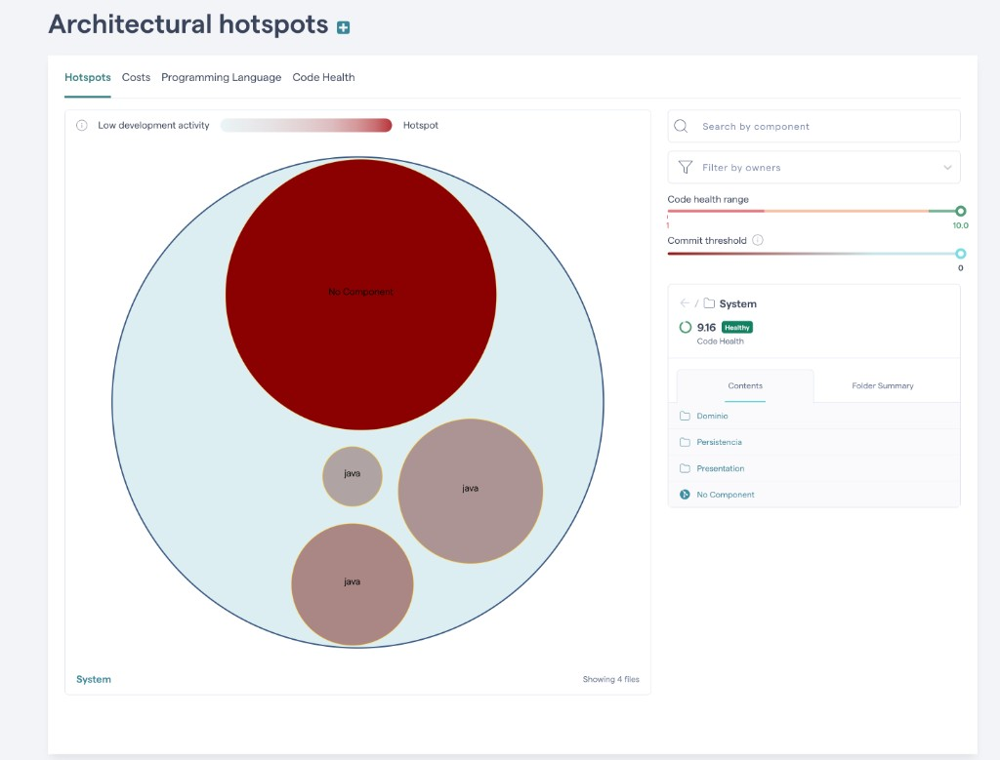

> **Acción pendiente:** reconfigurar patrones con prefijo `spring-petclinic/` y rutas explícitas por archivo (ver sección de configuración del equipo). Agregar componente `Infraestructura`. Tras re-análisis, esta vista debe reflejar el acoplamiento entre capas del diagrama A4.

---

### Comparativa: documentación legacy vs. arquitectura actual

| Aspecto | Slides legacy (pre–Spring Boot) | Código actual verificado |
|---------|--------------------------------|--------------------------|
| Framework | Spring MVC clásico, config XML/Java manual | Spring Boot 4 auto-configuración |
| Empaquetado | WAR / despliegue en servlet container | JAR embebido (Tomcat incluido) |
| Persistencia | iBatis / JDBC (en versiones antiguas) | Spring Data JPA + Hibernate |
| BD | Configuración manual | Perfiles + scripts SQL multi-motor |
| API | Solo HTML | HTML + `GET /vets` JSON |
| Observabilidad | No documentada | Actuator completo en dev |
| i18n | Limitado | 9 locales con interceptor |
| Contenedores | No existía | build-image, K8s, docker-compose BD |

Fuente legacy: [Speaker Deck](https://speakerdeck.com/michaelisvy/spring-petclinic-sample-application) — el README advierte que está desactualizado.

---

## 1.4 Respuestas — Mantenibilidad (Iteración 2 — CodeScene)

> Análisis CodeScene del proyecto `spring-petclinic` · 12.381 LOC · 49 archivos · Java.

### M1 — Componentes más grandes (LOC)

**Medición manual vs. CodeScene:**

| LOC (repo) | LOC (CodeScene) | Archivo | Hotspot CodeScene |
|------------|-----------------|---------|-------------------|
| 183 | 124* | `PetController.java` | **Hotspot rojo** — alta actividad de cambios |
| 176 | — | `OwnerController.java` | **Hotspot rojo** — el más activo del cluster |
| 176 | 104 | `Owner.java` | No hotspot; Code Health **10/10** |
| 114 | — | `VisitController.java` | Hotspot rojo |
| 85 | — | `Pet.java` | Actividad moderada |

\* CodeScene mide LOC efectivas del archivo analizado (puede diferir del conteo bruto del repo).

**Hotspots principales (pestaña 2):** `OwnerController`, `PetController`, `VisitController`, `OwnerControllerTests`, `ClinicServiceTests`.

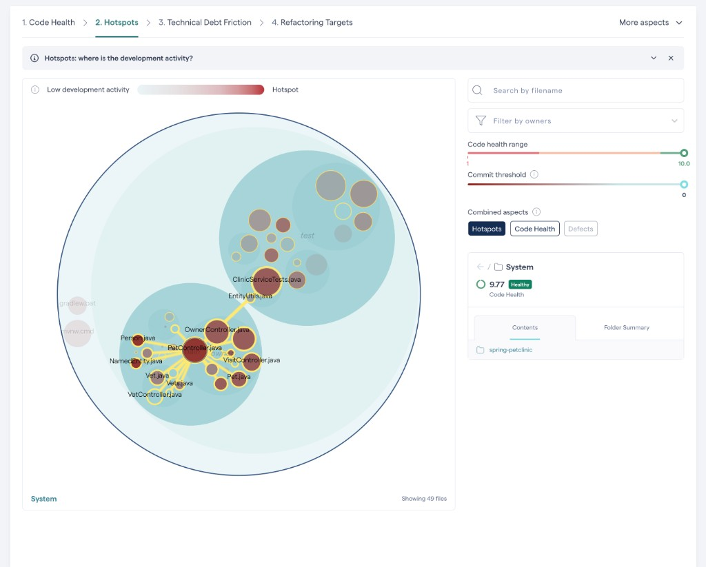

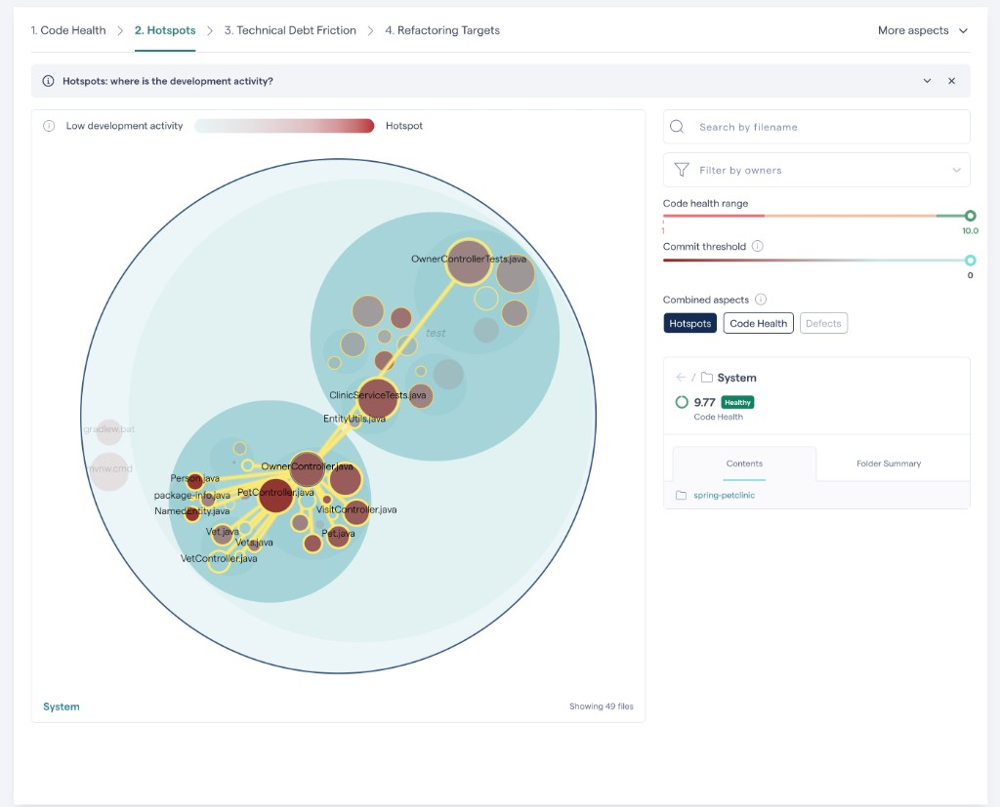

**Conclusión M1:** el paquete `owner/` concentra los hotspots de cambio. Los controllers son más activos que las entidades (`Owner.java` tiene solo 3 commits/año).

---

### M2 — Componentes más acoplados

**Acoplamiento estructural (Iteración 1) + change coupling (CodeScene):**

| Origen | Acoplado con | Evidencia CodeScene |
|--------|--------------|---------------------|
| `OwnerController` | `PetController`, `VisitController`, `OwnerControllerTests` | Líneas amarillas en mapa Hotspots |
| `PetController` | `OwnerController`, `VisitController`, `VetController`, `Pet.java` | Hotspot map centrado en PetController |
| `PetController` | `ClinicServiceTests`, `EntityUtils` | Coupling producción ↔ tests |
| `OwnerController` | `OwnerControllerTests` | Test hotspot vinculado al controller |

**Code Health global del sistema: 9.77 (Healthy)** — el acoplamiento es temporal (cambian juntos), no necesariamente baja salud global.

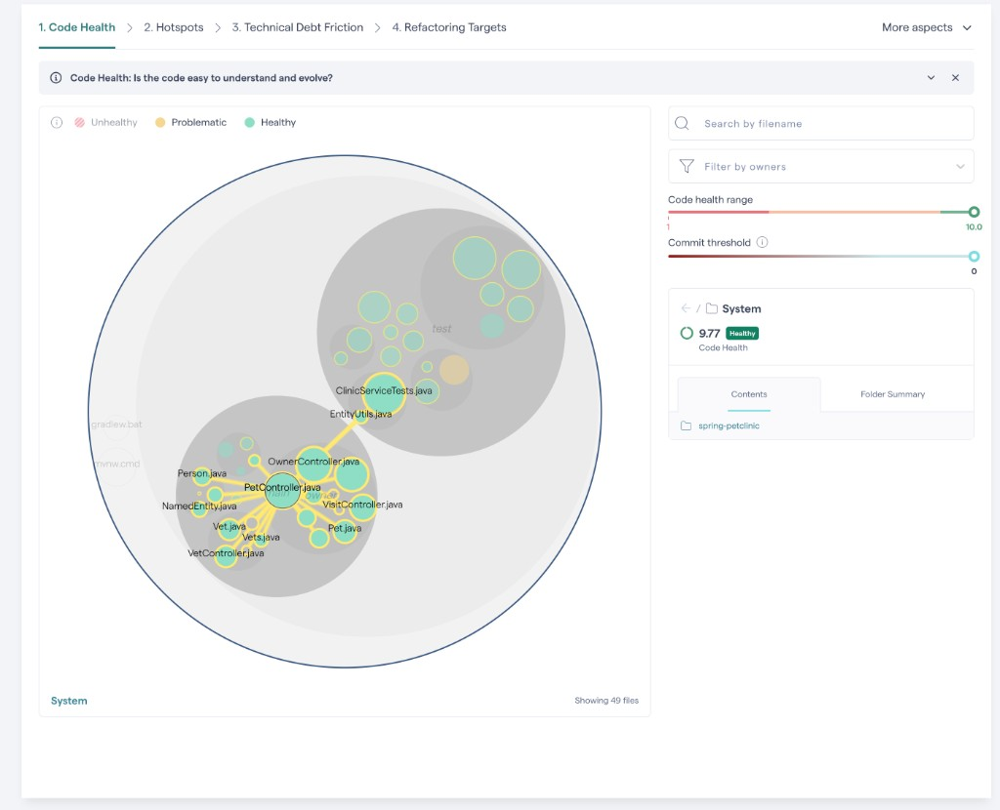

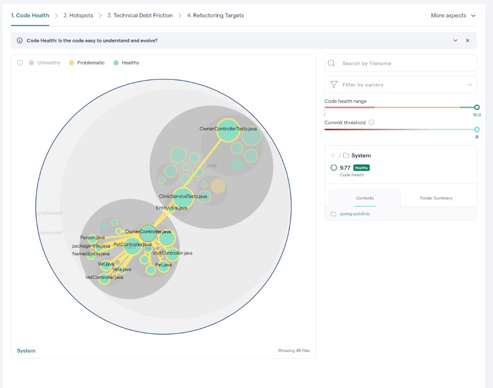

**Conclusión M2:** el acoplamiento más fuerte está en el triángulo `OwnerController` ↔ `PetController` ↔ `VisitController` y sus tests asociados.

---

### M3 — Código muerto, duplicado o mal ubicado

| Hallazgo | Evidencia manual | Evidencia CodeScene |
|----------|------------------|---------------------|
| `CrashController` demo | `/oups` lanza excepción | No aparece como hotspot |
| Lógica en controllers | Validaciones en `PetController` | X-Ray: métodos hotspot |
| Duplicación estructural | `@InitBinder` repetido | X-Ray **no detecta clones** entre archivos |
| Complejidad en métodos | — | `processCreationForm`: **Complex Conditional** (warning rojo) |
| | | `processUpdateForm`: change freq. 22, complexity 7 |

**X-Ray — `PetController.java`:**

| Método | Change freq. | LOC | Complexity | Alerta |
|--------|-------------|-----|------------|--------|
| `processUpdateForm` | 22 | 26 | 7 | Hotspot principal |
| `processCreationForm` | 19 | 21 | 7 | **Complex Conditional** |
| `findOwner` | 6 | — | 2 | OK |
| `initCreationForm` | 1 | — | 1 | OK |

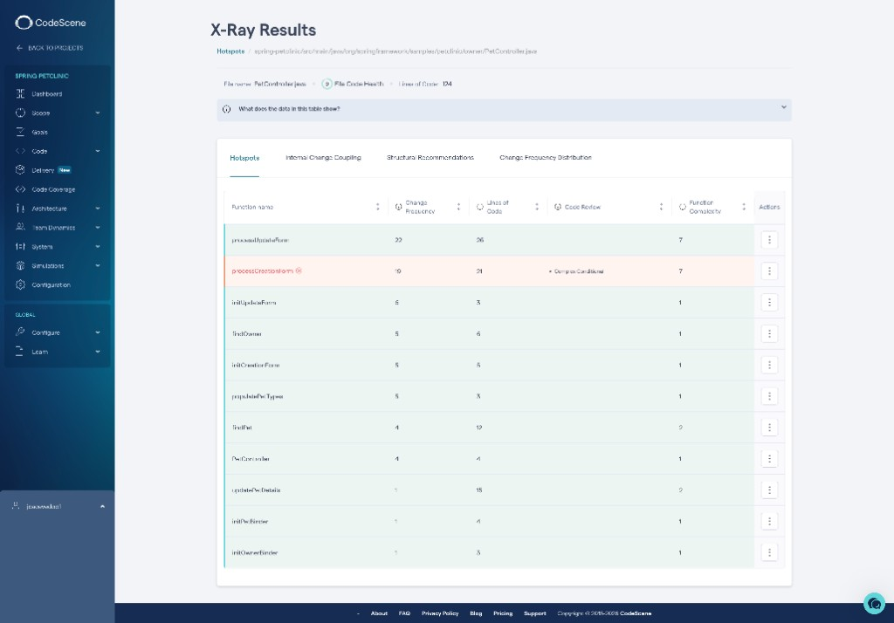

**Conclusión M3:** no hay duplicación explícita (clones) reportada, pero sí **lógica compleja duplicada en espíritu** entre `processCreationForm` y `processUpdateForm` (validación duplicado/fecha). Refactoring target natural: extraer validaciones a servicio o componente compartido.

---

### M4 — Cobertura y contexto del equipo

| Métrica | Valor |
|---------|-------|
| Archivos test / producción (repo) | 17 / 30 |
| LOC CodeScene | 12.381 |
| Archivos analizados | 49 |
| Code Familiarity | **100%** (código de developers activos) |
| Knowledge Islands | **5%** (2 archivos) |
| Bus factor | **67%** del código en **4 developers** |
| Coordinación alta | **17 archivos** requieren alta coordinación |

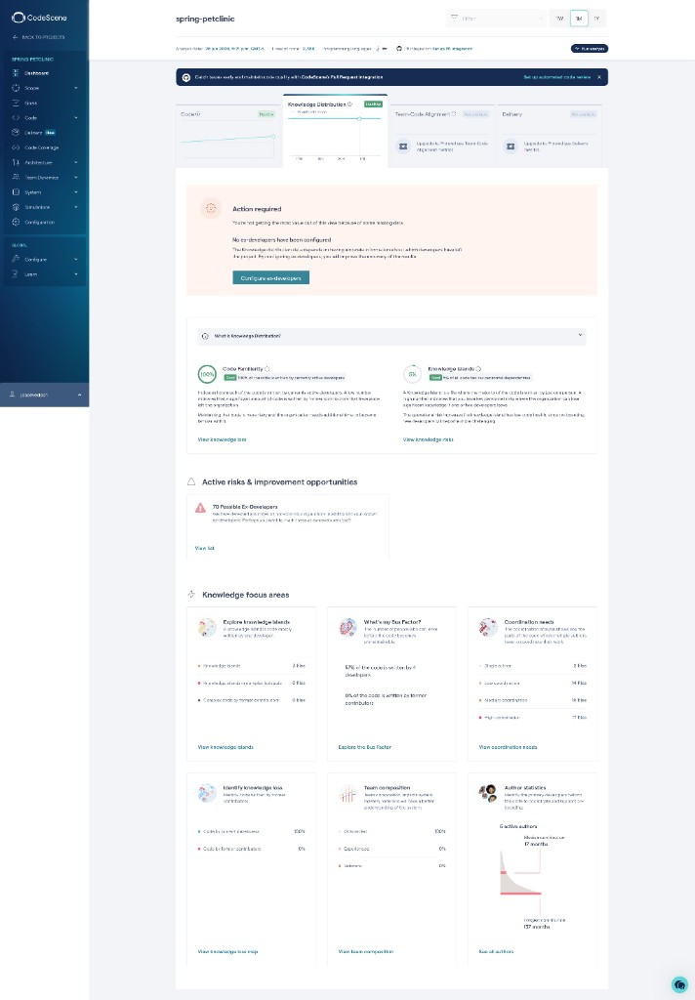

**Tests como hotspots:** `OwnerControllerTests` y `ClinicServiceTests` aparecen como hotspots — indican alta actividad de mantenimiento de tests, no baja cobertura.

**Technical Debt Friction:** CodeScene reporta *"Insufficient commit history"* — el análisis de fricción de deuda está limitado en este fork/clon.

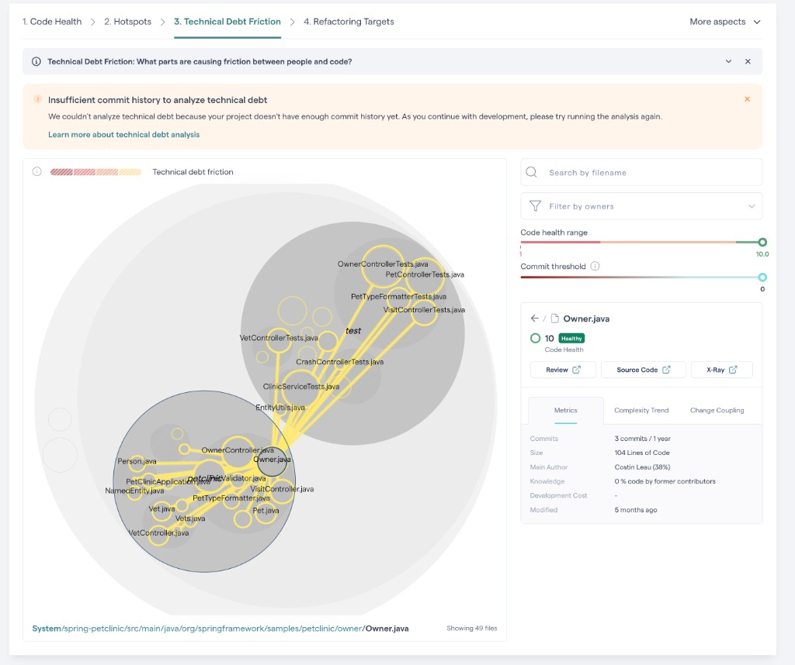

**Refactoring Targets:** sistema **9.77 Healthy**; oportunidades locales en amarillo. Aviso: componentes arquitectónicos no definidos en CodeScene.

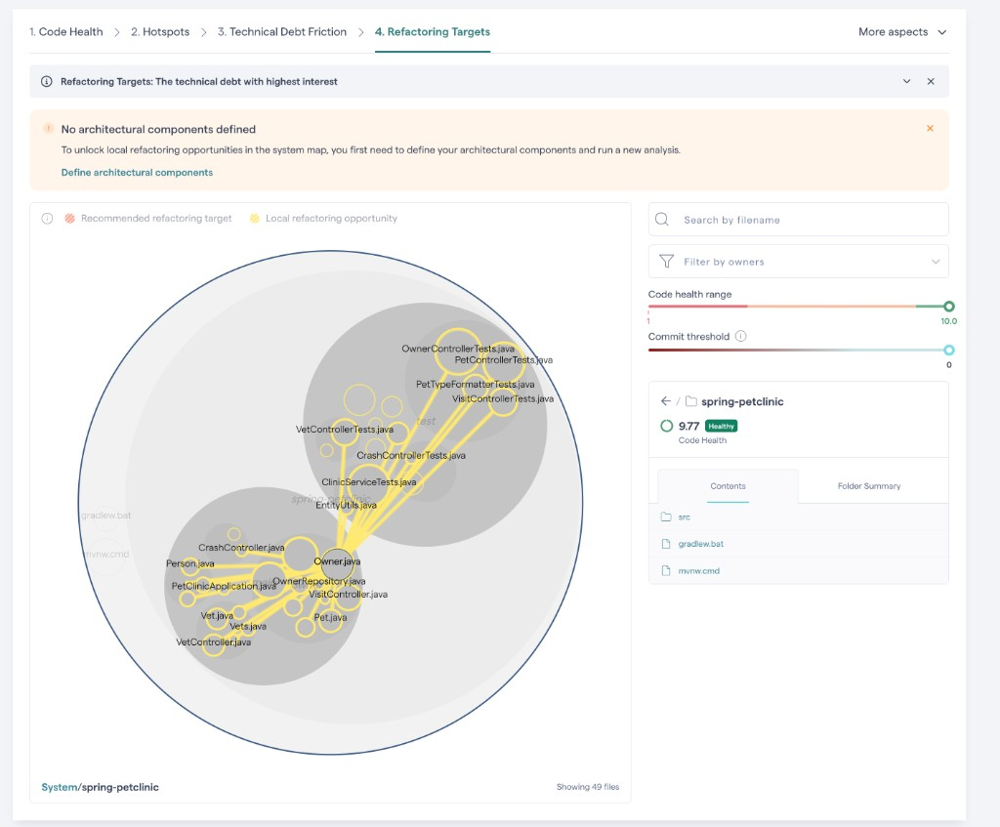

---

## 1.5 Atributos de calidad degradados (Iteración 2 — con métricas CodeScene)

**Respuesta: Sí, de forma focalizada** — el sistema global es saludable pero hay degradación localizada en áreas de alto cambio.

| Atributo | ¿Degradado? | Evidencia CodeScene + código |
|----------|-------------|------------------------------|
| **Mantenibilidad** | **Sí (localizada)** | Hotspots en controllers `owner/`; X-Ray: `processCreationForm` con **Complex Conditional**; `processUpdateForm` change freq. 22 |
| **Modificabilidad** | **Sí (moderado)** | Change coupling entre 3 controllers; 17 archivos con alta coordinación |
| **Testabilidad** | **No degradada** | Tests son hotspots activos (`OwnerControllerTests`); Code Health tests en verde |
| **Conocimiento / Bus factor** | **Riesgo bajo** | Code Familiarity 100%; 2 knowledge islands; bus factor 67% en 4 devs |
| **Deuda técnica (fricción)** | **No evaluable** | Insufficient commit history en CodeScene |
| **Seguridad** | **Sí (por omisión)** | No detectable en CodeScene; sin auth en código |
| **Rendimiento** | **No evidenciado** | — |
| **Usabilidad** | **No degradado** | — |
| **Portabilidad** | **No degradado** | Code Health global **9.77** |

### Paradoja clave para la modernización

> El **Code Health global es 9.77 (Healthy)** y el paquete `owner/` score **9.89**, pero los **controllers son hotspots rojos** con change coupling fuerte. La degradación no es "código roto" sino **alto costo de cambio futuro** en el módulo más activo.

### Tabla consolidada Code Health por archivo

| Archivo | LOC (CS) | Code Health | Hotspot | Refactoring target |
|---------|----------|-------------|---------|-------------------|
| `PetController.java` | 124 | **9/10** | Sí (rojo) | `processCreationForm`, `processUpdateForm` |
| `OwnerController.java` | — | **Healthy** (verde) | Sí (rojo, el mayor) | Extraer paginación/CRUD |
| `Owner.java` | 104 | **10/10** | No | Mantener |
| Paquete `owner/` | — | **9.89** | Concentración | Introducir capa Service |

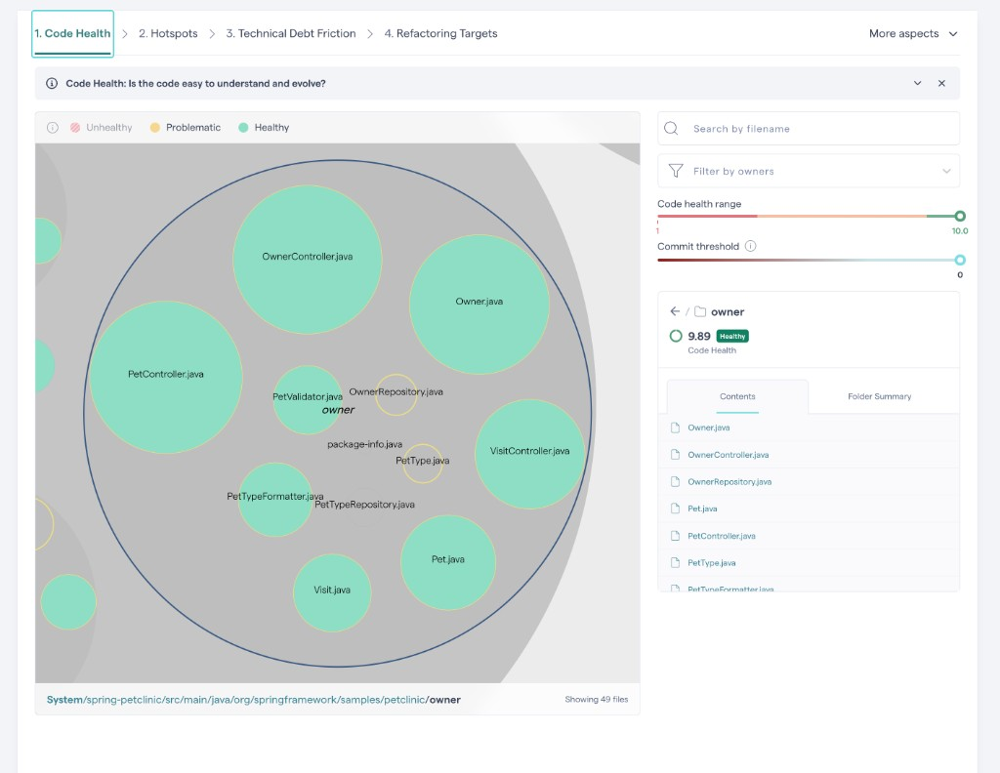

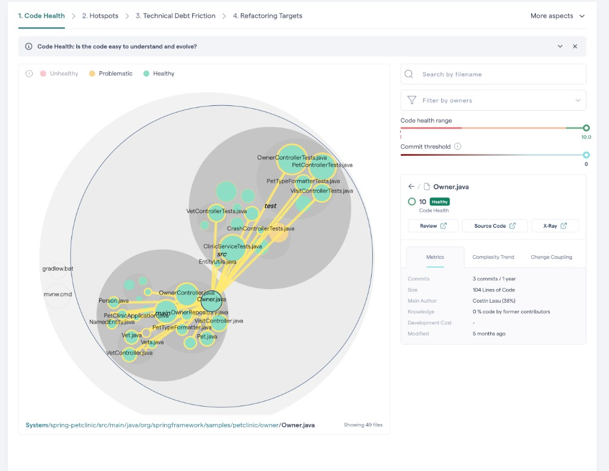

**Prioridad de modernización:** extraer lógica de `PetController` y `OwnerController` a capa `@Service` — coincide con Refactoring Targets locales (amarillo) y X-Ray hotspots.

---

# Actividad 2 — Estrategia y alcance

## 2.1 Motivador de negocio

**Motivador:** Garantizar la **evolución sostenible** de la clínica veterinaria digital para soportar integraciones externas, APIs móviles y despliegues cloud-native **sin incrementar el costo de cambio**.

| Driver | Atributo de calidad | Situación actual |
|--------|---------------------|------------------|
| Reducir time-to-market | Modificabilidad / Mantenibilidad | Degradada — lógica en controladores |
| Habilitar integraciones REST | Interoperabilidad | Solo `/vets` expone JSON |
| Alinear con ecosistema LTS | Portabilidad | Java 17 → migrar a Java 21 |
| Reducir riesgo en producción | Confiabilidad / Seguridad | Sin auth |

---

## 2.2 Estrategia de modernización

**Estrategia: Replatform + Rearchitect (Migration)**

| Estrategia | Qué implica en PetClinic | Justificación |
|------------|--------------------------|---------------|
| **Replatform** | Java 17 → **Java 21 LTS**; dependencias al día | Bajo riesgo; mantiene funcionalidad; habilita virtual threads, records |
| **Rearchitect** | Capa `@Service`, DTOs, API REST ampliada | Responde a mantenibilidad e interoperabilidad (cartografía M1–M2, A4) |
| **Refactor** | Descomponer hotspots; aislar `CrashController` | Evidencia CodeScene + LOC manual |

**Descartadas:**
- **Rewrite/Replace:** codebase pequeño y funcional; costo no justificado.
- **Strangler Fig:** monolito homogéneo; no hay subsistemas heterogéneos.

---

## 2.3 Alcance — Componentes a modernizar

**Evidencia:** `docs/plantuml/04-alcance-modernizacion.puml`.

| Componente | Decisión | Justificación |
|------------|----------|---------------|
| `owner/*` controllers | **Modernizar** | Hotspots rojos (CodeScene); X-Ray complexity en `PetController` |
| Capa `@Service` | **Crear** | Refactoring Targets locales; reduce change coupling entre controllers |
| `VetController` + REST | **Modernizar** | Base para API completa |
| Repositorios + entidades | **Mantener** | Estables, bien modelados |
| `system/` (welcome, cache, i18n) | **Mantener** | Sin deuda crítica |
| `CrashController` | **Evaluar/remover** | Demo; posible dead code (M3) |

---

## 2.4 Funcionalidades a modernizar

| ID | Funcionalidad | Descripción | Criterios de aceptación |
|----|---------------|-------------|-------------------------|
| **F-01** | Migración Java 21 | Toolchain, CI y runtime | Build Maven/Gradle OK; CI verde; app en Java 21 |
| **F-02** | Service — Owners | Extraer lógica de `OwnerController` | Controller delega; tests unitarios service |
| **F-03** | Service — Pets & Visits | Extraer `PetController`, `VisitController` | `PetController` < 100 LOC; tests OK |
| **F-04** | API REST — Vets | OpenAPI para veterinarios | `GET /api/vets` documentado; tests API |
| **F-05** | API REST — Owners | Consulta owners vía REST | `GET /api/owners`, `GET /api/owners/{id}` |
| **F-06** | Seguridad básica | Spring Security en API | Auth en `/api/**`; UI sin regresión |

**Justificación:** Se prioriza el módulo `owner/` (hotspot cartográfico) y la apertura API (interoperabilidad). F-01 es prerequisito transversal.

---

# Diagramas PlantUML

Los diagramas están en `docs/plantuml/` como archivos `.puml` (texto plano, versionables en Git).

## Diagramas incluidos

| # | Archivo | Propósito | Responde |
|---|---------|-----------|----------|
| 01 | `01-componentes-as-is.puml` | Arquitectura actual: controladores, repos, dominio, BD | A1 |
| 02 | `02-despliegue.puml` | Navegador, JVM, JAR, H2/MySQL/PostgreSQL, K8s | A2 |
| 03 | `03-modelo-dominio.puml` | Clases JPA, herencia, asociaciones | A3, A4 |
| 04 | `04-alcance-modernizacion.puml` | Qué modernizar, crear y mantener | Actividad 2 |
| 05 | `05-capas-arquitectonicas.puml` | Capas + deuda confirmada | A4 |
| 06 | `06-secuencia-buscar-owner.puml` | Flujo búsqueda owner | A1 |
| 07 | `07-secuencia-agregar-pet.puml` | Flujo agregar mascota | A1 |

## Visualizar y exportar PNG

**VS Code / Cursor:** extensión PlantUML → Preview Current Diagram.

**CLI:**

```bash
brew install plantuml   # si no está instalado
cd docs/plantuml
mkdir -p export
plantuml -o export -tpng *.puml
```

**Online:** [plantuml.com/plantuml](https://www.plantuml.com/plantuml/uml)

Insertar los PNG de `docs/plantuml/export/` en el informe Word/PDF final.

---

# Uso de IAG

| Actividad | Uso de IAG | Herramienta |
|-----------|------------|-------------|
| Exploración del repositorio | Análisis de estructura, LOC, patrones | Cursor Agent |
| Generación diagramas PlantUML | Archivos `.puml` de arquitectura | Cursor Agent |
| Redacción del documento | Borrador según rúbrica del curso | Cursor Agent |
| Métricas de mantenibilidad | Capturas CodeScene integradas por el equipo | CodeScene + Cursor |
| Decisiones de alcance | Revisión y aprobación del equipo | Equipo |

**Declaración:** IAG se usa como asistente de análisis y documentación. Las métricas cuantitativas provienen de CodeScene. Las decisiones de modernización son responsabilidad del equipo.

---

# Anexos CodeScene (Iteración 2 — completos)

Todas las capturas en `docs/codescene/`:

| Archivo | Vista | Sección |
|---------|-------|---------|
| `01-code-health-sistema.png` | Code Health — mapa sistema (9.77) | M2, 1.5 |
| `02-hotspots-petcontroller.png` | Hotspots — PetController | M1 |
| `03-hotspots-ownercontroller.png` | Hotspots — OwnerController | M1 |
| `04-code-health-ownercontroller.png` | Code Health — OwnerController | M2 |
| `05-code-health-paquete-owner.png` | Code Health — paquete owner (9.89) | 1.5 |
| `06-code-health-owner-java.png` | Code Health — Owner.java (10/10) | 1.5 |
| `07-technical-debt-friction.png` | Technical Debt Friction | M4 |
| `08-refactoring-targets.png` | Refactoring Targets | M4, Act. 2 |
| `09-xray-petcontroller.png` | X-Ray — PetController hotspots | M3 |
| `10-knowledge-distribution.png` | Knowledge Distribution | M4 |
| `11-architectural-hotspots.png` | Architectural Hotspots — capas (config. inicial) | A4 |

- [x] System Map / Code Health global
- [x] Hotspots — controllers owner
- [x] Code Health — OwnerController, Owner.java, paquete owner
- [x] Change coupling (visible en mapas 01, 02, 03, 04)
- [x] X-Ray / complejidad — PetController (sin clones explícitos)
- [x] Knowledge Distribution
- [x] Architectural Hotspots — configuración inicial de capas (parcial; ver A4)
- [ ] Architectural Hotspots — capas mapeadas correctamente (pendiente re-análisis)
- [ ] Trend / Evolution (opcional — no capturado)

---

## Referencias del repositorio

| Recurso | Ruta |
|---------|------|
| Código fuente | `src/main/java/org/springframework/samples/petclinic/` |
| Esquema BD | `src/main/resources/db/h2/schema.sql` |
| Despliegue K8s | `k8s/petclinic.yml` |
| Docker Compose | `docker-compose.yml` |
| Build / versión Java | `pom.xml` (java.version=17, Spring Boot 4.0.3) |
| Diagramas PlantUML | `docs/plantuml/*.puml` |
| Capturas CodeScene | `docs/codescene/*.png` |
